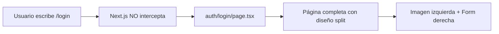

# Análisis: Sistema de Autenticación con Rutas Paralelas

## 📋 Resumen Ejecutivo

Tu aplicación usa **Parallel Routes** (Rutas Paralelas) de Next.js 14+ para mostrar el login de dos formas diferentes:

1. **Modal** (navegación suave) → `@auth/(.)login/page.tsx`
2. **Página completa** (acceso directo/refresh) → `(auth)/login/page.tsx`

---

## 🏗️ Arquitectura Actual

### Estructura de Archivos

```
app/
├── (public)/
│   └── layout.tsx          # Layout principal (incluye navbar)
│
├── (auth)/                 # Grupo de rutas de autenticación
│   ├── login/
│   │   └── page.tsx       # Página completa de login (acceso directo)
│   └── signup/
│       └── page.tsx       # Página completa de registro
│
└── @auth/                  # Slot de ruta paralela
    ├── (.)login/
    │   └── page.tsx       # Modal interceptado de login
    ├── (.)signup/
    │   └── page.tsx       # Modal interceptado de registro
    └── default.tsx        # Fallback cuando no hay modal activo
```

---

## 🔄 Flujo de Navegación

### Caso 1: Usuario hace clic en "Ingresar" (Navegación Suave)

```mermaid
graph LR
    A[Usuario en /] --> B[Click en 'Ingresar']
    B --> C[Next.js intercepta /login]
    C --> D[@auth/./login/page.tsx]
    D --> E[Modal se abre sobre la página actual]
    E --> F[Usuario ve modal + página de fondo]
```

**Archivo ejecutado:** `app/@auth/(.)login/page.tsx`

**Características:**
- ✅ Modal sobre la página actual
- ✅ URL cambia a `/login`
- ✅ Página de fondo sigue visible
- ✅ Cerrar modal = `router.back()`

---

### Caso 2: Usuario accede directamente a /login (URL directa o refresh)



**Archivo ejecutado:** `app/(auth)/login/page.tsx`

**Características:**
- ✅ Página completa (no modal)
- ✅ Diseño split: imagen + formulario
- ✅ Sin navbar (layout diferente)
- ✅ Mejor para SEO y acceso directo

---

## 🧩 Componentes Clave

### 1. Navbar - Botón "Ingresar"

**Archivo:** `components/layout/navbar/auth-buttons.tsx`

```tsx
<Link
  href="/login"
  className="px-3 py-2 rounded-lg font-semibold..."
>
  Ingresar
</Link>
```

**Comportamiento:**
- Click → Navegación client-side a `/login`
- Next.js intercepta y muestra el modal
- URL cambia pero página no se recarga

---

### 2. Modal Interceptado

**Archivo:** `app/@auth/(.)login/page.tsx`

```tsx
export default function LoginModal() {
  const router = useRouter();

  const handleOpenChange = (open: boolean) => {
    if (!open) {
      router.back(); // Volver a la página anterior
    }
  };

  return (
    <Dialog open={true} onOpenChange={handleOpenChange}>
      <DialogPrimitive.Portal container={document.body}>
        <DialogContent>
          <LoginFormStyled />
        </DialogContent>
      </DialogPrimitive.Portal>
    </Dialog>
  );
}
```

**Detalles técnicos:**
- `Dialog` siempre abierto (`open={true}`)
- `Portal` renderiza en `document.body` (evita z-index issues)
- Cerrar modal = `router.back()` (vuelve a la página anterior)

---

### 3. Página Completa

**Archivo:** `app/(auth)/login/page.tsx`

```tsx
export default function LoginPage() {
  return (
    <div className="min-h-screen flex">
      {/* Imagen izquierda (desktop) */}
      <div className="hidden lg:flex lg:w-1/2 bg-cover">
        
      </div>

      {/* Formulario derecha */}
      <div className="flex-1 flex items-center justify-center">
        <LoginFormStyled />
      </div>
    </div>
  );
}
```

**Diseño:**
- Split screen en desktop (50/50)
- Solo formulario en mobile
- Sin navbar (layout independiente)

---

## 🎯 Ventajas de este Enfoque

### ✅ Mejor UX
- **Modal rápido** para usuarios navegando
- **Página completa** para acceso directo
- No pierdes contexto al hacer login

### ✅ SEO Friendly
- `/login` es una URL real
- Puede ser indexada
- Funciona sin JavaScript

### ✅ Accesibilidad
- Funciona con navegación del navegador (back/forward)
- Refresh mantiene el estado
- Deep linking funciona

### ✅ Performance
- Modal no recarga la página
- Página completa solo cuando es necesario
- Lazy loading del modal

---

## 🔧 Configuración Técnica

### Route Interception Pattern

El prefijo `(.)` en `(.)login` significa:

| Pattern | Significado |
|---------|-------------|
| `(.)` | Intercepta rutas en el **mismo nivel** |
| `(..)` | Intercepta rutas **un nivel arriba** |
| `(..)(..)` | Intercepta rutas **dos niveles arriba** |
| `(...)` | Intercepta desde la **raíz** |

En tu caso:
```
@auth/(.)login  →  Intercepta /login (mismo nivel que @auth)
```

---

### Default Slot

**Archivo:** `app/@auth/default.tsx`

```tsx
export default function Default() {
  return null;
}
```

**Propósito:**
- Se muestra cuando NO hay modal activo
- Evita errores de Next.js
- Retorna `null` (no renderiza nada)

---

## 🚀 Mejoras Potenciales

### 1. Animación de Entrada del Modal

```tsx
// Agregar animación con Framer Motion
<motion.div
  initial={{ opacity: 0, scale: 0.95 }}
  animate={{ opacity: 1, scale: 1 }}
  exit={{ opacity: 0, scale: 0.95 }}
>
  <DialogContent>...</DialogContent>
</motion.div>
```

---

### 2. Manejo de Errores en URL

```tsx
// Redirigir si el usuario ya está logueado
const user = await getCurrentUser();
if (user) {
  redirect('/dashboard');
}
```

---

### 3. Preservar Query Params

```tsx
// Mantener ?redirect=/propiedades después del login
const searchParams = useSearchParams();
const redirect = searchParams.get('redirect');

// Después del login
router.push(redirect || '/dashboard');
```

---

### 4. Loading States

```tsx
<Suspense fallback={<LoginSkeleton />}>
  <LoginFormStyled />
</Suspense>
```

---

## 📊 Comparación: Modal vs Página Completa

| Aspecto | Modal (`@auth/(.)login`) | Página (`(auth)/login`) |
|---------|--------------------------|-------------------------|
| **Trigger** | Click en navbar | URL directa / refresh |
| **Layout** | Sobre página actual | Página completa |
| **Navbar** | Visible (detrás) | No visible |
| **URL** | `/login` | `/login` |
| **Back button** | Vuelve a página anterior | Vuelve en historial |
| **SEO** | No indexable | Indexable |
| **JavaScript** | Requerido | Funciona sin JS |

---

## 🎓 Recursos

- [Next.js Parallel Routes](https://nextjs.org/docs/app/building-your-application/routing/parallel-routes)
- [Next.js Intercepting Routes](https://nextjs.org/docs/app/building-your-application/routing/intercepting-routes)
- [Radix UI Dialog](https://www.radix-ui.com/docs/primitives/components/dialog)

---

## 🤔 Preguntas Frecuentes

### ¿Por qué usar rutas paralelas en lugar de un modal normal?

**Ventajas:**
1. **URL real** → Puedes compartir el link
2. **Historial del navegador** → Back button funciona
3. **Deep linking** → `/login?redirect=/propiedades` funciona
4. **SEO** → La página completa es indexable
5. **Accesibilidad** → Funciona sin JavaScript

### ¿Cuándo se muestra cada versión?

- **Modal:** Navegación client-side (Link, router.push)
- **Página:** Navegación server-side (URL directa, refresh, external link)

### ¿Cómo se comparte el formulario?

Ambas versiones usan el mismo componente:
```tsx
<LoginFormStyled />
```

Esto evita duplicación de código y mantiene la lógica centralizada.

---

## ✅ Conclusión

Tu implementación de autenticación con rutas paralelas es **excelente** y sigue las mejores prácticas de Next.js 14+. Combina:

- ✅ UX fluida con modales
- ✅ SEO con páginas completas
- ✅ Accesibilidad con URLs reales
- ✅ Performance con lazy loading

¡Muy bien implementado! 🎉
